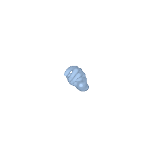
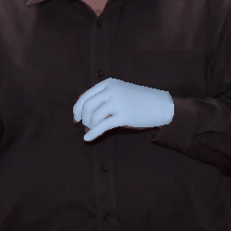
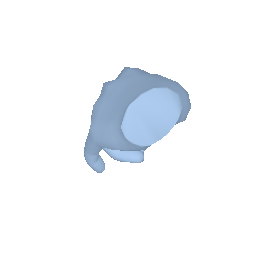
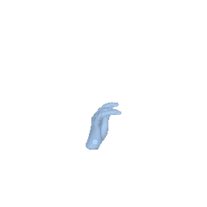
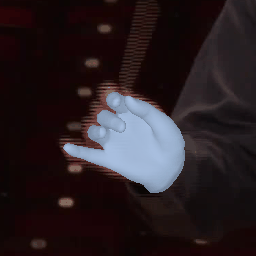
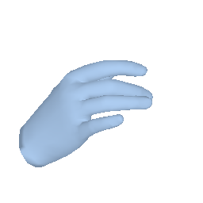

# Predicting 4D Hand Trajectory from Monocular Videos
Yufei Ye, Yao Feng, Omid Taheri, Haiwen Feng, Shubham Tulsiani*, Michael J. Black* (*Equal Contribution)

TLDR: Existing methods produce convincing reprojection but their 4D trajectories are not plausible. HaPTIC reconstructs Hand Pose and 4D hand Trajectory in consistent global Coordinate while maintaining strong 2D alignment.


## Installation 
- Install environment and download our pretrained model.
    ```
    conda create -n haptic python=3.10 -y
    conda activate haptic
    bash scripts/one_click.sh
    ```
- Addtionally, due to license restriction, you need to download the MANO model from the official [MANO website](https://mano.is.tue.mpg.de/). Put the files under
    ```
    assets/
        mano/
            MANO_RIGHT.pkl
            ...
        example/
            vid1/video.mp4
            vid2/video.mp4
            video_list.yaml
    ```


## Demo
Given a list of video under `data.video_dir`, predict hand trajectories:
```
python -m demo -m  expname=release/mix_all \
    data.video_dir=assets/examples \
    data.video_list=assets/examples/video_list.yaml
```
Uncomment lines in [`assets/examples/video_list.yaml`](assets/examples/video_list.yaml) to run on more videos.

You should see something similar to this: 
Global overlay | Global sideview | Local overlay | Local sideview | 
 | -- | -- | -- | -- | 
|  |  |  |  |
|  |  |   |  


## Training

### Prepare training data
- Download our preprocessed video labels and single-image training batch
```
bash dl_training_data.sh
```

- Download raw RGB images from each datasets official website individually. Specify their root directory in `haptic/configs/datasets_tar.yaml:${DATASET}.img_dir`
    - HO2O
    - DexYCB
    - ARCTIC
    - HO3Dv3
    - InterHand2.6M


### Train your own model

```
python -m train \
    expname=reproduce/\${DATASETS.name} \
    data=ego_mix
```

<!-- ## Evaluation -->


## Acknowledge
Parts of the code are taken or adapted from the following repos:
- [HaMeR](https://github.com/geopavlakos/hamer)
- [Detectron2](https://github.com/facebookresearch/detectron2)
- [DiT](https://github.com/facebookresearch/DiT)

## Citing

```
@article{ye2025predicting,
    title={Predicting 4D Hand Trajectory from Monocular Videos},
    author={Ye, Yufei and Feng, Yao and Taheri, Omid and Feng, Haiwen and Tulsiani, Shubham and Black, Michael J},
    journal={arXiv preprint arXiv:2501.08329},
    year={2025}
}
        
```